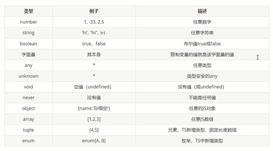

# typescript-learn
TS学习
# 一、TS是什么
- 1.是以JS为基础构建的语言，可在任何支持JS的平台中执行
- 2.TS是JS的超集(扩展，新特性)，TS扩展了JS并添加了类型
- 3. TS不能直接被JS解析器执行，需要编译----TS=====编译===》JS
## 1.1vscode 增加扩展
- 执行tsc 文件名 -w 监听
## 1.2webstore配置
- 监视：增加tsconfig.json文件-------tsc 文件 -w
# 二、TS基础
- 安装npm i typescript -g
- tsc init ：生成tsconfig.json文件
- webpack搭建的时候使用ts-loader处理.ts文件
## 2.1 基本变量
- 申明变量给变量同时指定类型
- 
```ts
//1.数字
let a:number;

//2.布尔类型
let b:boolean;

//3.字符串 
let tom:string;

//4.数组Array<类型>
let list:number[];//数组数字类型
let list2:Array<number>;//Array<>

//5.元组 Tuple
let d:[number,string];
let d2:[string,number];
d = [222,'tom'];
d2 = ['tom',222];
console.log(d2[0].substr(1)); // OK
// console.log(d[5].toString()); // OK, 'string' 和 'number' 都有 toString

//6.enum 枚举
enum Color {Red, Green, Blue}
let c: Color = Color.Green; 
enum Color2 {Red = 1, Green=2, Blue}
let colorName: string = Color2[2];
console.log(colorName);  // 显示'Green'因为上面代码里它的值是2

//7.Any类型--想要为那些在编程阶段还不清楚类型的变量指定一个类型使用any
let x: any = 4;
x = "tom";
x = false; // 最终布尔类型

//8.Void------void类型像是与any类型相反，它表示没有任何类型。 当一个函数没有返回值时，你通常会见到其返回值类型是 void：
//声明一个void类型的变量只能赋予undefined和null：
let xx: void = undefined;
function shang(): void {
  console.log("tom");
}
//9.Null 和 Undefined
let u: undefined = undefined;
let n: null = null;

//10.Never--------never类型表示的是那些永不存在的值的类型;never类型是任何类型的子类型，也可以赋值给任何类型
//没有类型是never的子类型或可以赋值给never类型（除了never本身之外）。 即使 any也不可以赋值给never。
// 返回never的函数必须存在无法达到的终点
function error(message: string): never {
  throw new Error(message);
}

// 推断的返回值类型为never
function fail() {
  return error("Something failed");
}

// 返回never的函数必须存在无法达到的终点
function infiniteLoop(): never {
  while (true) {
  }
}

//11.Object 表示非原始类型

declare function create(o: object | null): void;

create({ prop: 0 }); // OK
create(null); // OK

//描述一个对象的类型
type myType = {
  name:string;
  age:number;
}
/**
 * 1.使用type描述一个对象的类型
 * 2.创建对象并且申明该对象的类型cosnt myObj:类型 = {}
 *    此时对象中有且仅有该类型中的参数--仅有name,age
 */

  const obj:myType = {
  name:'ss',
  age:20
}
```
### 2.1.1 declare关键字<span style="color:red;font-weight:800;">用于类型声明</span>
1. 对于type,interface等这些明确的Ts类型（只能在Ts中使用）可以省略declare关键字
2. 对于let,function等具有双重含义（JS,TS都可使用），应该声明declare关键字，明确指定此处用于类型声明
```ts
//types.d.ts
declare let count:number;
interface myinter{
  name:string,
  id:number
}
```
### 2.1.2类型断言
- 用来告诉解析器变量的实际类型
```ts
/**
 * 语法：
 *  变量 as 类型
 *  <类型>变量
 * 
 * */
s = a as string
s = <string>a
``` 
### 2.1.3函数参数返回值
- 用来告诉解析器变量的实际类型
```ts
function a(x:string,y:boolean):number{
  retun 222
}
a('tom',true)
function b(){ //没写返回类型，返回viod

}
function b():void{ //无返回值
  // return null
}

function b():never{ //什么都不返回，没有值
  // return null
}
``` 
### 2.1.4设置函数结构的类型申明（object）
- (参数：参数类型)=>返回值
```ts
let abc5 : (x:string,y:string)=>string;
abc5 = function(x1,x2){
  return x1+x2;
}
``` 
# 三、面向对象
 - 要创建对象，就要先定义类，规定类里面的方法和属性
## 3.1类
1. 使用类创建对象 
2. 关键字 static readonly
3. 类只能调用类属性，不能直接调用类方法
4. 类的修饰符，具体看后面接口
>   1. public 修饰的属性可以在任意位置访问(修改)----不写修饰符即默认public
> 2. protected 受保护的属性，只能在当前类和当前类的子类访问(修改)
> 3. private  私有属性 只能在类内部进行访问---****只能在类中访问
          - 通过类中添加方法，使得私有属性可以被外部访问(修改)
     
```ts
class A {
  /**
   * 直接定义的属性是实例属性，通过对象的实例去访问
   *   let newtom = new A();
   *   newtom.name
   */
  name: string = 'tom';

  /**
   * static 静态属性，不需要创建对象就可以使用的属性,通过类调用
   * A.namex
   */
  static namex: string = 'tom2';

  /**
   * readonly 只读属性 只能读取不能改变
   */
  readonly namey: string = 'tom3';
  constructr(mes: string) {
    this.name = mes
  }

  /**
   *  类方法
   */
  greet() {
    return 'heelo' + this.name;
  }
  /**
   *  static 静态方法方法
   */
  static greet2() {
    return 'heelo' + this.name;
  }
}
console.log(A.name);
let newtom = new A();
console.log(newtom.name);
newtom.greet()
console.log(A.namex); //static属性通过类调用

```
### 3.1.1类的简写方法
- 类的简写:在构造器中定义参数的时候加属性（public private protect）
```ts
(function(){
  class A{
    name:string;
    age:number;
    constructor(name:string,age:number){
      this.name = name;
      this.age = age;
    }
  }
  // 类的简写:在构造器中定义参数的时候加属性（public private protect）
  class A2{
    constructor(public name:string,public age:number){

    }
  }
  const newA = new A('tom',17);
  const newA2 = new A2('tom',19);
})()
```
## 3.2 构造函数和this
- 构造函数会在创建对象时调用,在实例方法中this表示当前实例
```ts
class Dog{
  name:string;
  color:string;
  /**
   * 构造函数会在创建对象时调用
   * 在实例方法中this，this表示当前实例
   */
  constructor(name:string,color:string){
    this.name = name;
    this.color = color;
  }
  bark(voice:string){
    console.log(voice);
  }
}

let newblackDog = new Dog('小黑','黑色');
console.log(newblackDog);
newblackDog.bark('汪汪');

```
## 3.3 继承
1. extends 使用继承之后，子类会有父类的全部属性和方法
2. 可以对方法重写，和新增方法与属性。
3. super() 调用父类构造函数, 派生类的构造函数必须有super()的调用
```ts
/**
 * (function(){------------立即执行函数，防止重名
 * })();
 */
class Animal{
  name:string;
  age:number;
  constructor(name:string,age:number){
    this.name = name;
    this.age = age;
  }
  bark(vioce:string){
    console.log(vioce);
  }
}
/**
 * 1.extends 使用继承之后，子类会有父类的全部属性和方法
 * 2.可以对方法重写，和新增方法与属性。
 */
class Dog extends Animal{
  name:string;
  age:number;
  color:string;
  constructor(name:string,age:number,color:string){
    //super() 调用父类构造函数, 派生类的构造函数必须有super()的调用
    super(name,age);
    this.color =color;
  }
  // 重写方法
  bark(){
    console.log('汪汪');
  }
  // 新增方法
  run(bushu:number){
    console.log(`跑了${bushu}步`);
    
  }
}
let blackDog = new Dog('旺财',18,'red')
console.log(blackDog);
console.log(blackDog.name);
blackDog.run(200);
```
## 3.4 抽象类
1. abstract 开头的类称为抽象类，抽象类不能，创建对象，只能被用来继承
2. <span style="color:red;font-weight:800;">抽象类只能拿来继承（生而为父，我很抱歉😂）</span>
3. 抽象类可以添加抽象方法
    1. 抽象方法使用abstract开头，没有方法体，子类拿来重写
    2. 继承了该抽象类（含抽象方法）,必须重写方法
```ts
(function(){
  /**
   * abstract 开头的类称为抽象类，
   *   1.抽象类不能，创建对象，只能被用来继承（生而为父，我很抱歉😂）
   *   2.抽象类可以添加抽象方法
   *        抽象方法使用abstract开头，没有方法体，子类拿来重写
   *        继承了该抽象类（含抽象方法）,必须重写方法
   */
  abstract class Animal{
    name:string;
    age:number;
    abstract say(voices:string):void
  }
  //抽象类只能拿来继承
  class Dog extends Animal {
    constructor(){
      super()
    }
    say(voice:string){
      console.log(voice);
    }
  }
})()
```
## 3.5 接口
- <span style="color:red;font-weight:800;">***定义一个标准，限制类，给类一个规范***</span>
1. interface 用来定义一个类结构，用来定义一个类中应该包含那些属性和方法
2. 接口可以在定义类的时候限制类结构
    - (1). 接口中所有的属性都不能有实际的值，接口只定义类的结构，不考虑实际值
    - (2). 接口中所有方法都是抽象方法
3. 接口也可当做类型申明去使用（类似type）
    - (1). 类型检查器不会去检查属性的顺序，只要相应的属性存在并且类型也是对的就可以
```ts
(function(){
  /**
   * 1.使用type描述一个对象的类型
   * 2.创建对象并且申明该对象的类型cosnt myObj:类型 = {}
   *    此时对象中有且仅有该类型中的参数--仅有name,age
   */
  type myType = {
    name:string;
    age:number;
  }
   const obj:myType = {
    name:'ss',
    age:20
  }

  /**
   * 1.interface 用来定义一个类结构，用来定义一个类中应该包含那些属性和方法
   * 2.接口可以在定义类的时候限制类结构
   *      （1）接口中所有的属性都不能有实际的值，接口只定义类的结构，不考虑实际值
   *      （2）接口中所有方法都是抽象方法
   * 3.接口也可当做类型申明去使用（类似type）
   *    （1）类型检查器不会去检查属性的顺序，只要相应的属性存在并且类型也是对的就可以
   */
  interface myInterface{
    name:string;
    color:string;
  }
  const obj2:myInterface = {
    color:'ddd',
    name:'ss'
  }

  //定义一个接口,定义类属性和抽象方法
  interface myClassInterface{
    name:string;
    say():void
  }
  //定义一个类来实现接口
  class Dog implements myClassInterface {
    name:'小黑';
    say(){
      console.log("汪汪汪");
    }
  }
})()
```
## 3.6 属性的封装
1. get 方法-----调用get方法：对象.方法名
2. set方法----调用set方法：对象.方法名
3. 使用get和set方法时报错：访问器仅在针对ECMAScript 5及更高版本时可用；使用命令tsc 项目名称 -t es5
```ts
  class person{
    /**
     * public 修饰的属性可以在任意位置访问(修改)----不写修饰符即默认public
     * protected 受保护的属性，只能在当前类和当前类的子类访问(修改)
     * private  私有属性 只能在类内部进行访问---****只能在类中访问
     *          - 通过类中添加方法，使得私有属性可以被外部访问(修改)
     */
    public _name:string;
    private _age:number;
    protected _color:string;
    // constructor(name:string,age:number,color:string){
    //   this._age = age
    // }
    setname(value:number){
      if(value>0){
        this._age = value;
      }
      console.log(this._age);
    }

    /**
     *  get 方法获取私有属性
     *      - 调用get方法 -------对象.方法名
     *  set 方法设置私有属性的值
     *      - 调用set方法 -------对象.方法名
     */
    set ages(value:number){
      if(value>0){
        this._age = value;
      }
      console.log(this._age);     
    }
  }

  const newperson = new person();
  newperson.ages = 20;
  console.log(newperson._name);
  class man extends person{
    name:string = 'tonm';
    say(){
      console.log(this._color);  
      
    }
  }
  console.log(man.name);
  const newman = new man()
  newman.say();
```
## 3.7 泛型
- 在类型不明确时候指定变量，使用时是什么类型该变量就是什么类型
- 函数中：fn<T>(name:T):T{}
```ts
(function(){
  function fn<T>(name:T):T{
    return name;
  }
  fn(22)//不指定泛型---ts会检测出
  fn<string>('tom')//指定泛型
  
  //可以定义多个泛型
  function fn2<T,K>(a:T,b:K):K{ 
    console.log(b);
    return b //返回K类型
  }

  //接口中使用泛型********
  interface myinter{
    age:number;
  }
  //泛型K必须是myinter的实现类
  function fn3<T extends myinter>(a:T):T{
    return a;
  }
  fn3({age:666});//必须含有age属性

  //在类中使用泛型
  class A<k>{
    constructor(public name:k){
    }
  }  
  const newA = new A('tom')//不指定泛型
  const newA2 = new A<number>(22)//指定泛型
})()
```
## 3.8 类型的泛型工具
1. Ts内置工具类，简化TS中一些常见的操作
### 1.Partial<Type> 用来构建（创造）一个类型，将Type的所有属性设置为可选
```ts
interface Props{
  id:string;
  name:string;
  children:number[];
}
// 构造出来的新类型newType结构和Props相同，但是所有属性都变为可选的
type newType = Partial<Props>
const myobj:newType = {
  id:'ddd'
}
```
### 2.Readonly<Type> 只读类型，该类型创建的对象只可读取，不可写
```ts
interface Props{
  id:string;
  name:string;
  children:number[];
}
type newType2 = Readonly<Props>
const myobj2:newType2 = {
  id:'ddf',
  name:'fff',
  children:[2]
}
```
### 3.Pick<Type,keys> 选择属性，选择一组属性，来构造新类型;选择keys时用|分隔
```ts
interface Props{
  id:string;
  name:string;
  children:number[];
}
type newType3 = Pick<Props,'id'|'name'>//只选择了id,则该类型只含有id
const myobj3:newType3 ={
  id:'jjj',
  name:'ddd'
}
```
### 4.Record<keys,Type> keys是一组属性，Type为这一组的类型;定义keys时用|分隔
```ts
interface Props{
  id:string;
  name:string;
  children:number[];
}
type newType4 = Record<'a'|'b'|'c',string[]>
const myobj4:newType4 = {
  a: ['aa'],
  b: ['bb'],
  c: ['cc']
}
```
## 3.9 类型的索引签名
0. 当无法确定对象中含有哪些属性（对象中出现多个属性）就要用到索引签名类型
1. [key:类型]只要是该类型的属性名称，都可以出现在对象中
2. [key:类型] key只是一个占位符，可以换成任意合法的变量名
3. **注意：JS中对象的({})的键是string类型
```ts
interface newType{
  // 只要是string类型的属性名称都可以出现在对象中
  [k:string] :number
}
interface newType2<T>{
  [k:number] :T
}
const a:newType = {
  a:333,
  b:333,
  c:555
}
const newa:newType2<number> = [1,2,3]
```
## 3.10 类型的映射
* 基于旧类型，创建新类型（对象型），减少重复提升开发率
* 1.映射类型只能在类型别名type中使用，不能在接口中使用
* 2.keyof映射联合类型，获取其他类型的key；[key in keyof newType]:类型
```ts
type typeKeys = 'a'|'b'|'c';
type props = {a:number,b:number,c:number} //重复率高
// 做映射
type props2 = {[key in typeKeys]:number}
const myobj:props2 = {
  a:22,
  b:33,
  c:44
}
```
### （2）keyof映射联合类型，获取其他类型的key；[key in keyof newType]:类型
```ts
type newType = {
  a:number,
  b:string,
  c:[]
}
type newType2 = {[key in keyof newType]:number}//  type newType2 = {a:number,b:number,c:number}
```
## 3.11 类型的索引查询
1. 查询方式typenames[属性名]
2. 同时查询多个索引类型 typenames[属性名1|属性名2];或者使用keyof----myType[keyof myType] 
```ts
type  myType = {
  a:string,
  b:number,
  c:boolean
}
type types = myType['a'] //type types = string

// 2.同时查询多个索引类型 
type types2 = myType['a'|'b'] //type types = string|number
type types3 = myType[keyof myType] //type types = string|number|boolean
```
# 四、ts类型申明文件
- 用来为已存在的JS库提供类型信息
## 4.1 Ts中两种文件类型
1. .ts文件（***代码实现文件***）
> 1. 既包含类型信息又可执行代码
> 2. 可以被编译成.js文件，再执行代码
2. .d.ts文件（***类型声明文件***）
> 1. 只包含类型信息的类型申明文件
> 2. 不会生成.js文件，仅用于提供类型信息
> 3. 用途：为js提供类型信息
## 4.2 类型声明文件的类型
1. 内置类型声明文件
> 1.Ts为Js运行时可用的所有标准化内置API都提供了声明文件
> 例如在使用数组时,数组所有方法都有对应代码提示和类型提示
2. 第三方库的类型声明文件
> 1.库自带声明文件
> 2.由DefinitelyTyped提供
## 4.3 自定义类型声明文件
1. 在.d.ts文件中declare关键字的使用
2. 需模块化导出 export {}
3. 在.ts文件中导入import 文件
```ts
//types.d.ts
declare let count:number;
declare function add(x:number,y:number):number

interface myinter{
  name:string,
  count
}
type myType = {
  a:string,
  b:number
}
//index.ts
import './类型声明文件/types'
const myobj:myType = {
  a:'tom',  
  b:29
}
const a:myinter = {
  name:'tom',
  count:999
}
console.log(add(1,2));
```
# 五、在React中使用TS
## 5.1. 使用CRA(create-react-app)创建支持TS的项目
1. 创建TS项目命令 npx creacte-react-app 项目名称 -- template typescript
2. 创建antd项目： yarn create react-app 项目名 --template typescript 配置<a herf="https://ant.design/docs/react/use-in-typescript-cn">查看官网<a>
### 5.1.1 配置文件介绍
1. react-app-env.d.ts(React 项目默认的类型声明文件)
> ///三斜线指令：指定依赖的其他类型声明文件，types表示依赖的类型声明包的名称
> 
> react-script的类型声明文件包含两部分1.react,react-dom,node的类型；2.图片样式等模块的类型，以允许在代码中导入图片以及SVG等文件
> TS会自动加载该.d.ts文件，以提提供类型声明（通过修改tsconfig.json中的include配置来验证）
## 5.2. TS配置文件tsconfig.json
- tsc --init可自动生成tsconfig.json配置文件
1. include[文件名]：该文件下所有文件都会被TS执行
## 5.3. React中常用类型
1. 在TS项目中使用TypeScript实现组件类型校验（代替PropsTypes）----static Type Checking
> 通过@types/react @types/react-dom类型申明包来提供类型 
## 5.4. React中函数式组件的类型
### 5.4.1 函数组件和属性的类型
1. 简写写法fc------functionComponent<>泛型
```tsx
interface Props {
  name:string;
  age?:number;
}
const Head: FunctionComponent<Props> = ({name,age}) => {
  return (
    <div>
      {name}
    </div>
  )
}
export default Head;
//渲染Head组件 
<Head name='tom'/>
```
2. 简写写法const Head = ({name,age}:Props) =>(<div></div>)
```ts
interface Props {
  name:string;
  age?:number;
}
const Head = ({name,age}:Props) =>(<div></div>)
export default Head;
//渲染Head组件 
<Head name='tom'/>
```
### 5.4.2 函数组件属性的默认值
1. 使用：组件名.defaultProps = {age:18}
```ts
interface Props {
  name:string;
  age?:number;
}
const Head: FunctionComponent<Props> = ({name,age}) => {
  return (
    <div>
      {name}
    </div>
  )
}
Head.defaultProps = {
  age:19
}
export default Head;
//渲染Head组件 
<Head name='tom'/>
```
2. 简写写法const Head = ({name,age}:Props) =>(<div></div>)
```ts
interface Props {
  name:string;
  age?:number;
}
const Head = ({name,age=19}:Props) =>(<div></div>)
export default Head;
//渲染Head组件 
<Head name='tom'/>
```
### 5.4.3 函数组件事件绑定和事件对象
-  查看事件类型: <input type="text" onchange={e=>{}}/>
```ts
const Head = ({name,age=19}:Props) =>{
  const toshow = (e:React.MouseEvent<HTMLButtonElement>)=>{
    //访问该Dom对象
    console.log(e.cuuruntTarget.scroll);
  }
  const towrite = (e:React.ChangeEvent<HTMLInputElement>)=>{
    //访问该Dom对象
    console.log(e.target.value);
  }  
  return(
    <div>
      <p>{name}:{age}</p>
      <button onClick={toshow}></button>
      <input type="text" onchange={towrite}/>
      {/* //查看事件类型 */}
      <input type="text" onchange={e=>{}}/>
      
    </div>    
  )
}
Head.defaultProps = {
  age:19
}
export default Head;
//渲染Head组件 
<Head name='tom'/>
```
## 5.5. React中类式组件
- 快捷键：tsrcc
### 5.5.1 类组件的类型
1. class C1 extends React.Component{}//无Prop无State
2. class C2 extends React.Component<Props>{}//有Prop无State
3. class C3 extends React.Component<{},State>{}//无Prop有State
4. class C4 extends React.Component<Props,State>{}//有Prop有State
### 5.5.2 类组件的属性和设置属性默认值
1. 设置默认值static defaultProps:Partial<Props> = {name:'tom'}
```ts
import React, { Component } from 'react'
type Props = {
  name:string;
  age?:number
}
type State = {}
export default class Hello extends Component<Props, State> {
  state = {}
  static defaultProps:Partial<Props> = {
    name:'tom'
  }
  render() {
    const {name} = this.props
    return (
      <div>{name}</div>
    )
  }
}

```
2. 简写方式
```ts
import React, { Component } from 'react'
type Props = {
  name:string;
  age?:number
}
type State = {}
export default class Hello extends Component<Props, State> {
  state = {}
  render() {
    const {name='tom'} = this.props
    return (
      <div>{name}</div>
    )
  }
}

```
### 5.5.2 类组件的状态和事件
1.   state:State = { count:0 }
```ts
import React, { Component } from 'react'
type Props = {
  name:string;
  age?:number
}
type State = {
  count:number
}
export default class Hello extends Component<Props, State> {
  state:State = {
    count:0
  }
  add = ()=>{ 
    const newcount = count++
    this.setState({count:newcount})
  }
  // static defaultProps:Partial<Props> = {
  //   name:'tom'
  // }
  render() {
    const {name='tom'} = this.props
    return (
      <div>
      {name}
      <p>{this.state.count}</p>
      <button onClick={toadd}></button>
      </div>
      )
  }
}

```
